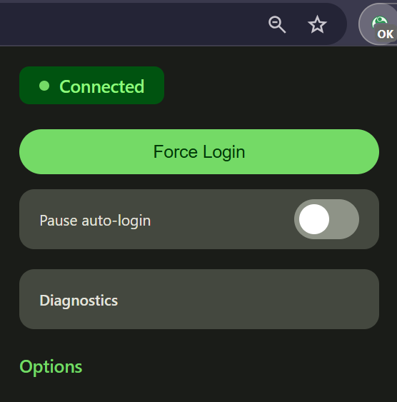

# IITG Wi-Fi Auto-Login Extension 自動ログイン 🚀

A modern Manifest V3 extension for Chrome and Edge that provides a seamless, "set-it-and-forget-it" solution for the IITG campus Wi-Fi.

 
---

## ✨ Features

* **Silent Autologin:** Automatically detects the captive portal and logs in with your saved credentials. No manual intervention needed!
* **Proactive Session Renewal:** Re-authenticates before the 20-minute session expires to prevent annoying connection drops.
* **Material You UI:** A clean and modern popup interface that respects your system's light or dark mode. 🌗
* **Status at a Glance:** The extension icon changes color for instant feedback:
    * 🟢 **Green:** Connected and online.
    * 🔴 **Red:** Error or network down.
    * ⚪️ **Default:** Idle or checking.
* **Robust Error Handling:** Features a retry mechanism with exponential backoff for network or portal issues.
* **Lightweight & Secure:** Built on the modern and secure Manifest V3 platform, using minimal permissions.

---

## 🛠️ Installation

1.  **Download:** Download this repository as a ZIP file and unzip it on your computer.
2.  **Open Extensions Page:**
    * In Chrome, navigate to `chrome://extensions`
    * In Edge, navigate to `edge://extensions`
3.  **Enable Developer Mode:** Turn on the "Developer mode" toggle, usually found in the top-right corner.
4.  **Load the Extension:** Click on the "Load unpacked" button and select the `iitg-wifi-autologin` folder that you unzipped.
5.  **Pin the Extension:** Pin the extension to your toolbar for easy access.
6.  **Add Credentials:** Click the extension icon, go to "Options", and enter your IITG username and password.

You're all set! The extension will now handle logins for you automatically. ✅

---

## 🔧 Development

This project is built with standard HTML, CSS, and JavaScript. No build tools are required.

-   `background.js`: The core service worker that handles all logic.
-   `popup.html` / `popup.js`: The UI and logic for the toolbar popup.
-   `options.html` / `options.js`: The UI and logic for the settings page.
-   `manifest.json`: The extension's manifest file.

Feel free to fork the repository and contribute!
